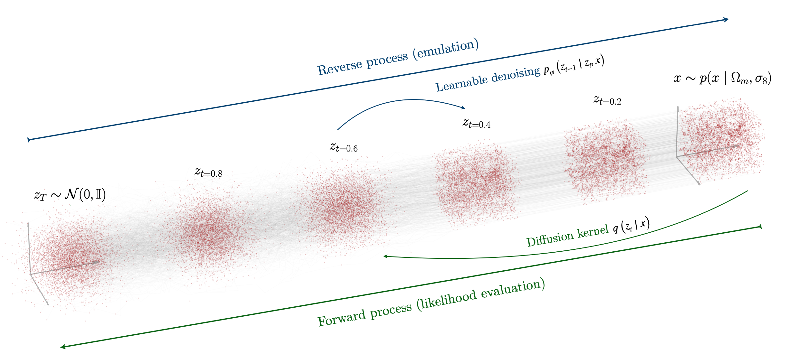

# A point cloud approach to field level generative modeling<!-- omit from toc -->

Carolina Cuesta-Lazaro and Siddharth Mishra-Sharma

[](https://opensource.org/licenses/MIT)
[](https://arxiv.org/abs/2311.17141)



## Contents<!-- omit from toc -->

- [Abstract](#abstract)
- [Dependencies](#dependencies)
- [Dataset](#dataset)
- [Code overview](#code-overview)
- [Running the code](#running-the-code)
- [Diffusion model basic usage](#diffusion-model-basic-usage)
- [Citation](#citation)

## Abstract

We introduce a diffusion-based generative model to describe the distribution of galaxies in our Universe directly as a collection of points in 3-D space (coordinates) optionally with associated attributes (e.g., velocities and masses), without resorting to binning or voxelization. The custom diffusion model can be used both for emulation, reproducing essential summary statistics of the galaxy distribution, as well as inference, by computing the conditional likelihood of a galaxy field. We demonstrate a first application to massive dark matter haloes in the _Quijote_ simulation suite. This approach can be extended to enable a comprehensive analysis of cosmological data, circumventing limitations inherent to summary statistics- as well as neural simulation-based inference methods.

## Dependencies

The Python environment is defined in `environment.yml`. To create the environment run e.g.,
``` sh
mamba env create --file environment.yaml
```

For evaluation of the nbody dataset, `Corrfunc` is needed:
``` sh
python -m pip install git+https://github.com/cosmodesi/pycorr#egg=pycorr[corrfunc]
```

## Dataset

The processed dark matter halo features from the _Quijote_ simulations used to train the model can be found [here](https://drive.google.com/drive/folders/16etX6fHLlJQqD9K_UIzAbiDFkSmAuIBu?usp=share_link). Make sure to update the hard-coded `DATA_DIR` in [`datasets.py`](datasets.py) to point to the location of the dataset before training.

## Code overview

- The diffusion model is defined in [`models/diffusion.py`](models/diffusion.py), with auxiliary utilities (loss, sampling, noise schedules) in [`models/diffusion_utils.py`](models/diffusion_utils.py). The model is based on the [google-research/vdm](https://github.com/google-research/vdm) repo.
- Score models are called from [`models/score.py`](models/score.py), with the transformer model defined in [`models/transformer.py`](models/transformer.py) and the GNN model in [`models/gnn.py`](models/gnn.py).

## Running the code

With the dataset in place, the diffusion model can be trained via
``` sh
python train.py --config ./configs/nbody.py
```
which is called from `scripts/submit_train.sh`. The config file `./configs/nbody.py` (which sets diffusion, score model, and dataset configuration) can be edited accordingly. Similarly, `scripts/submit_infer.sh` computes the likelihood profiles for the trained model, calling `infer.py`.

The [`notebooks`](notebooks/) directory contains notebooks used to produce results for the paper, each linked from the respective figures. 

## Diffusion model basic usage

For standalone usage, the following can be used to compute the variational lower bound loss and sample from the model:

``` py
import jax
import jax.numpy as np

from flax.core import FrozenDict

from models.diffusion import VariationalDiffusionModel
from models.diffusion_utils import generate, loss_vdm

# Transformer (score model) args
score_dict = FrozenDict({"d_model":256, "d_mlp":512, "n_layers":5, "n_heads":4, "induced_attention":False, "n_inducing_points":32})

# Instantiate model
vdm = VariationalDiffusionModel(gamma_min=-6.0, gamma_max=6.0,  # Min and max initial log-SNR in the noise schedule
          d_feature=4,  # Number of features per set element, e.g. 7 for (x, y, z, vx, vy, vz, m)
          score="transformer",  # Score model; "transformer", "graph"
          score_dict=score_dict,  # Score-prediction transformer parameters
          noise_schedule="learned_linear",  # Noise schedule; "learned_linear", "learned_net" (monotonic neural network), or "linear" (fixed)
          embed_context=False,  # Whether to embed context vector.
          timesteps=0,  # Number of diffusion steps; set 0 for continuous-time version of variational lower bound
          d_t_embedding=16,  # Timestep embedding dimension
          noise_scale=1e-3,  # Data noise model
          n_pos_features=3,  # Number of positional features, for graph-building
        )

rng = jax.random.PRNGKey(42)

x = jax.random.normal(rng, (32, 100, 4))  # Input set, (batch_size, max_set_size, num_features)
mask = jax.random.randint(rng, (32, 100), 0, 2)  # Optional set mask, (batch_size, max_set_size); can be `None`
conditioning = jax.random.normal(rng, (32, 6))  # Optional conditioning context, (batch_size, context_size); can be `None`

# Call to get losses
(loss_diff, loss_klz, loss_recon), params = vdm.init_with_output({"sample": rng, "params": rng}, x, conditioning, mask)

# Compute full loss, accounting for masking
loss = loss_vdm(params, vdm, rng, x, conditioning, mask)

# Sample from model

mask_sample = jax.random.randint(rng, (24, 100), 0, 2)
conditioning_sample = jax.random.normal(rng, (24, 6))

x_samples = generate(vdm, params, rng, (24, 100), conditioning_sample, mask_sample)
x_samples.mean().shape  # Mean of decoded Normal distribution -- (24, 100, 4)
```

## Citation

If you use this code, please cite our paper:

```
@article{Cuesta-Lazaro:2023zuk,
    author = "Cuesta-Lazaro, Carolina and Mishra-Sharma, Siddharth",
    title = "{A point cloud approach to generative modeling for galaxy surveys at the field level}",
    eprint = "2311.17141",
    archivePrefix = "arXiv",
    primaryClass = "astro-ph.CO",
    reportNumber = "MIT-CTP/5651",
    month = "11",
    year = "2023"
}
```
